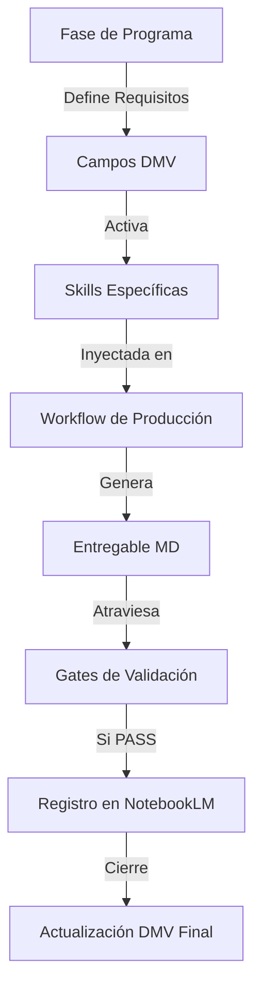

# File: output/arquitectura/ARQ_01_mapa_de_componentes_de_la_app.md
# ──────────────────────────────────────────────────────────────────────
# Propósito: Mapa de componentes y flujo operativo de la App.
# Rol: Definición de la cadena de valor desde el input al entregable.
# ──────────────────────────────────────────────────────────────────────

# 1. Flujo Operativo Explícito (Cadena de Valor)

El sistema opera en una secuencia lógica donde la información se transforma de "narrativa bruta" a "conclusiones auditadas".

# 2. Roles y Responsabilidades por Componente

| Actor / Componente | Acción Principal | Responsabilidad |
|---|---|---|
| **Estructura de Fase (@core_app)** | **DECIDE** | Define qué campos son necesarios y cuál es el criterio de éxito. |
| **Antigravity Runtime (@runtime)**| **EJECUTA** | Redacta el contenido usando las **Skills** y orquestando el **Workflow**. |
| **Validación Determinista (@val)** | **VALIDA** | Ejecuta los **Gates** técnicos (Python) para asegurar estructura y IDs. |
| **NotebookLM (@research)** | **REGISTRA** | Almacena la evidencia y la nota final para auditoría semántica. |
| **DMV (@data)** | **PERSISTE** | Mantiene el estado vivo del proyecto del emprendedor. |

# 3. Interacciones Críticas

1. **Fase -> DMV**: La fase dicta el "Contrato de Datos". Si estamos en Fase 03, el DMV exige obligatoriamente campos de `propuesta_valor`.
2. **Skill -> Workflow**: Un workflow es una "receta" (ej. `workflow_producir_entregable.md`) que usa herramientas (skills ej. `skill_analisis_competitivo.md`).
3. **Entregable -> Gate**: Un entregable no se considera "real" hasta que el Gate (ej. `validar_entregables.py`) devuelve un `PASS`.
4. **Gate -> Registro**: El registro en NotebookLM solo ocurre si los gates deterministas están aprobados, evitando "ensuciar" la base de conocimientos con basura estructural.

# 4. El Programa Convierte como "Orquestador Editorial"

El **Programa Convierte** (metodología) actúa de forma transversal:
- Proporciona las **Plantillas** para los entregables.
- Inyecta el **Marco Rector de Redacción** (Tono de voz de auditor, no de asistente).
- Define los **Criterios de Auditoría Semántica** que Antigravity usa para auto-corregirse antes de pasar el gate técnico.
